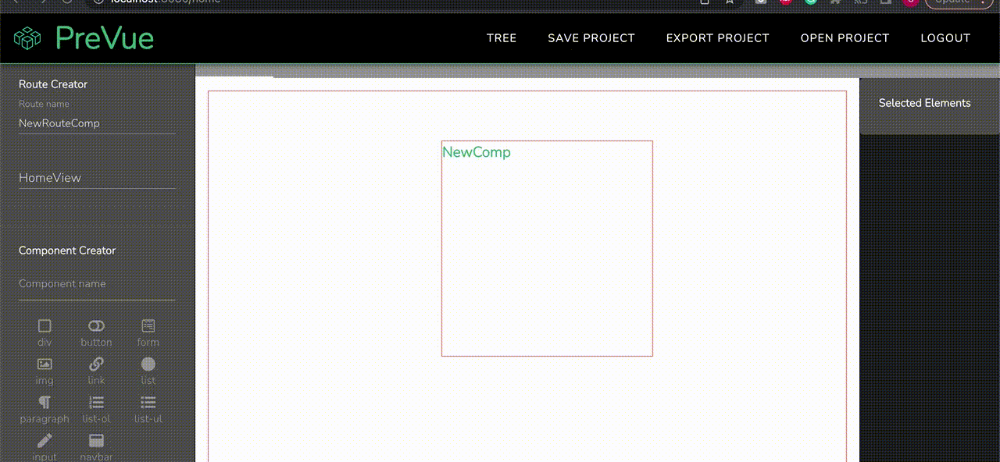

<p align="center">
  
  <h1 align="center">PreVue </h1>
</p>

[](https://github.com/teamprevue/PreVue/pulls)


<h3 align="center">
All-in-One Prototyping Tool 
For Vue Developers

</h3>

<h4 align="center">
From Component Architecture to Code Exporting
</h4>

<!-- <h4 align='center'>
  https://www.prevue.live
</h4> -->

<p align="center">
  
</p>

PreVue allows users to conceptualize and visualize component architecture by allowing them to :

&rarr; Build components, visualize UI and preview the associated code
&rarr; Set up different routes and views
&rarr; Establish parent-child component relationships
&rarr; View application hierarchy in tree format
&rarr; Save and open projects that are currently in progress, ensuring that completed work is not lost and can be revisited at any time
&rarr; Export component architecture as a Vue application created with default Vite settings

Use PreVue to create projects in single sessions or sign in with GitHub to save projects and update them at your convenience!

<!-- <p align="center">
  
</p> -->

## Getting Started

## How to use

---

#### Adding Components

- Double click on the application icon
- Create components by entering a name and clicking the HTML elements you need
- Clicked elements will be shown in the right sidebar
- Drag the elements to change their order
- Once you're satisfied, click the button to ‘add a component’ and it will show up in the working area. Resize and move components to fit the design you have in mind.


#### Editing Components

- Double click elements to bring up the modal view
- Add additional elements to a component with a live preview of the component code
- Drag elements on the right side bar to nest elements
- Establish parent-child component relationships via the dropdown menu when creating or editing components


#### Adding Routes

- Create different routes that represent different Views for your app.
- Any components created on a given route will be automatically saved to that route
- See your application’s hierarchy by clicking the ‘Tree’ icon in the navigation bar

<p align="center">

</p>

#### Tree View of Application Architecture

<p align="center">
  

</p>

#### Saving/Opening/Exporting Projects

- In order to utilize the saving and opening functionality of PreVue, please clone the repo to run on your local machine.
- If you're signed in with GitHub, click the ‘Save Project’ icon to save it to PreVue’s database
- Click ‘Open Project’ to retrieve past projects
- Once you're satisfied, click the export project icon to export your awesome project as new Vue application!
- Other users can use PreVue's playground to create and export projects in single sessions.



##### Code Exporting

Below is the generated directory structure of the Vue application that is created when you export your design.

```
src/
  assets/
  App.vue
  components/
    UserCreatedComponent1.vue
    UserCreatedComponent2.vue
    ...
  views/
    HomeView.vue
    UserCreatedRouteComponent1.vue
    UserCreatedRouteComponent2.vue
    ...
```

## Running your own local version

### Setup

Coming soon!

## Built With

---

1. [Express](https://expressjs.com/)
2. [Jest](https://jestjs.io/)
3. [MongoDB](https://www.mongodb.com/)
4. [Mongoose](https://mongoosejs.com/)
5. [Node.js](https://nodejs.org/en)
6. [SuperTest](https://www.npmjs.com/package/supertest)
7. [Vite](https://vitejs.dev/)
8. [Vue Router](https://router.vuejs.org/guide/#html)
9. [Vue Test Utils](https://test-utils.vuejs.org/)
10. [Vue.js](https://vuejs.org/)
11. [Vuex](https://vuex.vuejs.org/)
12. [Vuetify](https://vuetifyjs.com/)

## Changelog

---

PreVue 3.0 Adds:

- OAuth integration with GitHub for secure authentication
- Full CRUD functionality for prototype creation
- Implementation of appropriate hierarchical relationships reflected in UI
- Website and Homepage redesign for seamless user experience
- Realistic rendering of elements to Component Display
- Delete and Undo functionality for individual Components
- Project saving, loading & export ability

PreVue 2.0 Adds:

- Implementation of PreVue as a web application
- TypeScript integration
- Backend infrastructure built with Node/Express
- General UI/UX enhancements
- Testing with Vitest and Supertest (and Jest)

## Contributing to PreVue

---

We encourage you to submit issues for any bugs or ideas for enhancements. Please feel free to fork this repo and submit pull requests to contribute as well. Follow PreVue on [LinkedIn](https://www.linkedin.com/company/prevue-live/) for more updates.

Ideas for additional features include:

- Project livesharing for collaborative sessions (via Websockets)
- Migrate state management from Vuex to Pinia
- More thorough testing with Jest
- Ability to rename and add styling to individual components
- Containerization of PreVue App
- User Authentication updates via OAuth

## Authors

---

PreVue 3.0

- **Ilay Eskinazi** [@Pixolino](https://github.com/Pixolino)
- **Nathan Bornstein** [@greenteaisgreat](https://github.com/greenteaisgreat)
- **April Sanders** [@algorithmrhythm](https://github.com/algorithmrhythm)
- **Cole Jaeger** [@colejaeger0](https://github.com/colejaeger0)

Prevue 3.0

- **April Sanders** [@algorithmrhythm](https://github.com/algorithmrhythm)
- **Cole Jaeger** [@colejaeger0](https://github.com/colejaeger0)
- **Ilay Eskinazi** [@Pixolino](https://github.com/Pixolino)
- **Nathan Bornstein** [@greenteaisgreat](https://github.com/greenteaisgreat)

PreVue 2.0

- **Jason Boo** [@jasonboo123](https://github.com/jasonboo123)
- **Robert Drake** [@rmdrake8](https://github.com/rmdrake8)
- **Sean Flynn** [@seanflynn5](http://github.com/seanflynn5)
- **Zach Pestaina** [@zachpestaina](https://github.com/zachpestaina)

PreVue 1.0

- **Hubert Lin** [@hubelin](https://github.com/hubelin)
- **Franklin Pinnock** [@pinnockf](https://github.com/pinnockf)
- **Annette Lin** [@al2613](https://github.com/al2613)
- **Daniel Shu** [@danshuu](https://github.com/danshuu)

## License

---

This project is licensed under the MIT License - see the [LICENSE.md](LICENSE.md) file for details
